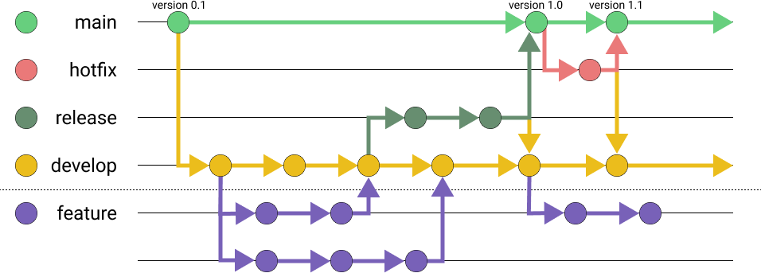

###### Monot - 内部開発者向けドキュメント

# Monot開発のブランチルール



Monotでは、上記のような [A successful Git branching model](https://nvie.com/posts/a-successful-git-branching-model/) を採用しています。

Monotでは、リモートリポジトリで管理する、main, hotfix, release, develop と、開発メンバーのローカルに存在する feature の五つのブランチで構成されます。

## 前提

**マージをする際は、`git merge` ではなく、`git merge --no-ff` を使用してください。**


## main

mainブランチには基本的に直接コミットすることはなく、releaseブランチまたはhotfixブランチからのマージだけで成り立ちます。また、mainには必ずバージョンのタグをつけます。そのため、mainブランチは常に提供できる状態じゃないといけません。
mainブランチにmergeする場合は、必ず代表者に許可をもらってください。

## develop

このブランチは、Monotを開発するときに基本的に使われるブランチです。基本的にはfeatureからmergeを行う先として使用します。

## feature

まず、注意点として**このブランチはリモートで管理しないでください**
新しくfeatureブランチを作るときには以下のように行います。
```git
git checkout -b myfeature develop
```
featureブランチで機能を作って完成させた場合、以下の手順でgit pushを行ってください。

```git
git checkout develop
git merge --no-ff myfeature
git branch -d myfeature
git push origin develop
```

## release

releaseブランチは、mainブランチにmergeする(バージョンを上げる)準備のためのブランチです。このブランチの名前は、必ず最初に`release-` がついていないといけません。また、作成、mergeには代表者の許可が必要になります。
基本的にこのブランチでは、リリース直前の細かなバグ修正等を行い、新機能の追加は行いません。
また、例外がない限り、前回のメジャーバージョンから半年～8ヵ月たったらreleaseブランチへと移行します。

新しくこのブランチを作ったら、まず最初にバージョンの設定を行ってください。
releaseブランチがmainブランチにmergeできる状態になったら、以下の手順で完了してください。

```git
git checkout main
git merge --no-ff release-1.1
git tag -a 1.1
git checkout develop
git merge --no-ff release-1.1
git branch -d release-1.1
```

## hotfix

hotfixブランチは、mainブランチに存在する、すでに提供されている物にすぐに修正すべきことが見つかったときに作られるブランチです。このブランチをmainにmergeする場合、代表者に許可を取ってください。

新しくこのブランチを作ったら、まず最初にバージョンの設定を行ってください。
hotfixブランチがmainブランチにmergeできる状態になったら、以下の手順で完了してください。

```git
git checkout main
git merge --no-ff hotfix-1.1.1
git tag -a 1.1.1
git checkout develop
git merge --no-ff hotfix-1.1.1
git branch -d hotfix-1.1.1
```

## 終わりに

これは、以下を参考にして書かれました。そのため、さらに詳しく知りたい人はこれらも見るといいかもしれません。

https://zenn.dev/yuki0410/articles/3360a6078d8e8c
https://nvie.com/posts/a-successful-git-branching-model/
https://qiita.com/homhom44/items/9f13c646fa2619ae63d0
https://backlog.com/ja/git-tutorial/stepup/05/
